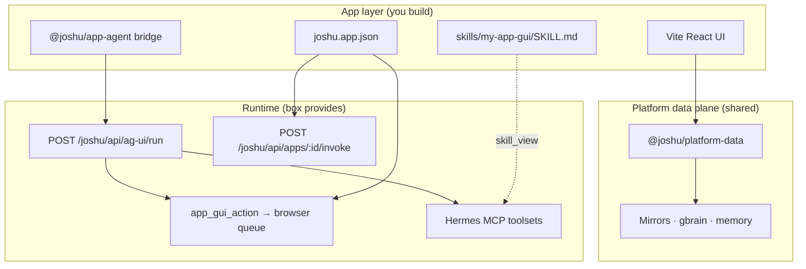
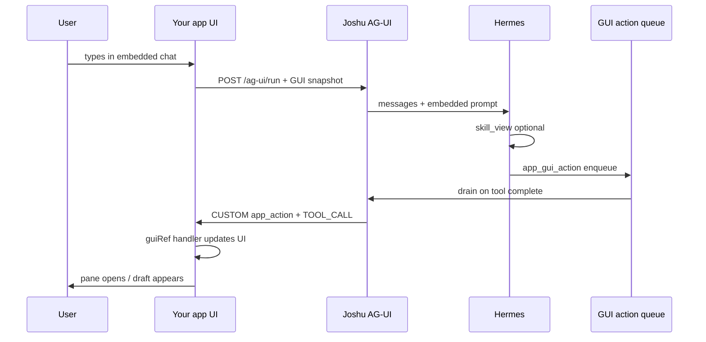
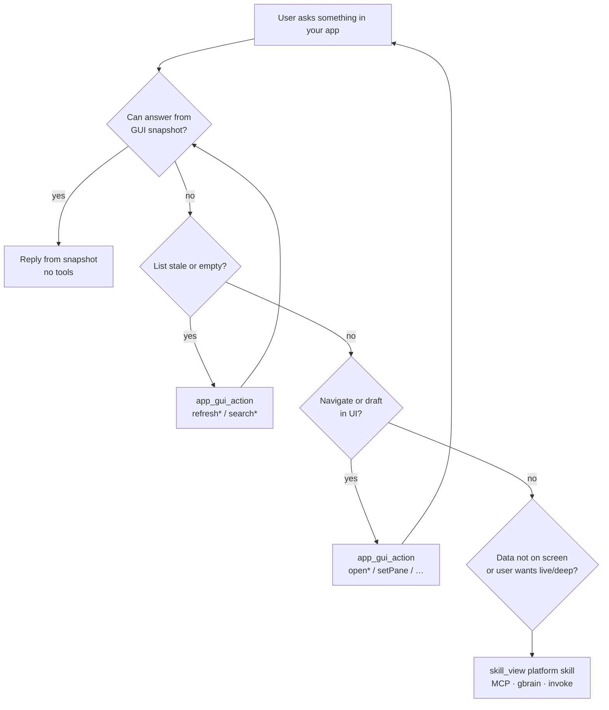
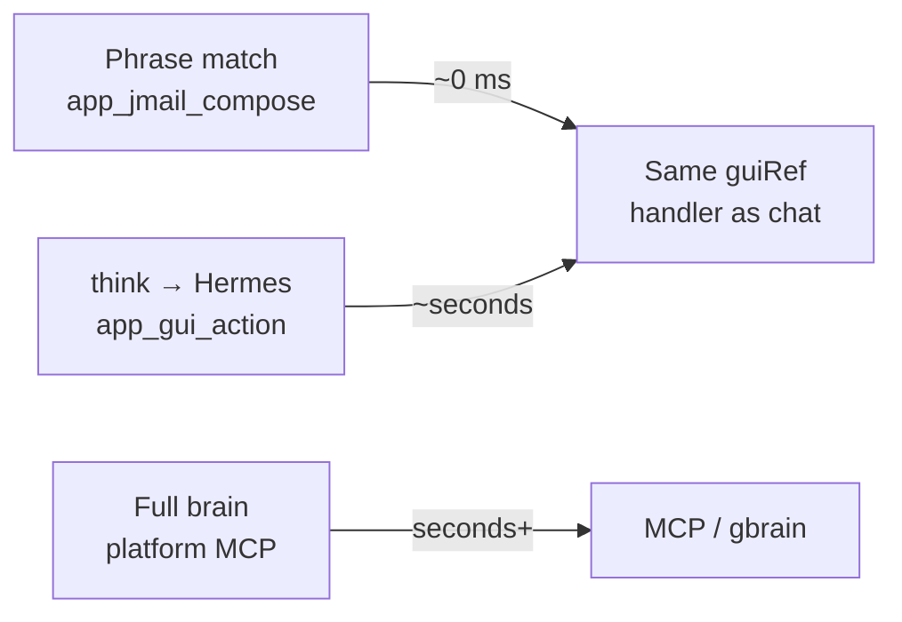

# Joshu app architecture — a gentle introduction

**Audience:** You have built Hermes **skills** before (`SKILL.md`, `skill_view`, MCP tools). You want to ship a **desktop app** where the agent speaks *and* moves the UI — including **low-latency voice** for simple commands.

**Reference app:** [jMail](jmail-arozos-app.md) — full stack example.

**Go deeper:** [platform-architecture.md](platform-architecture.md) (layers) · [app-agent.md](app-agent.md) (implementation cookbook) · [app-sdk.md](app-sdk.md) (manifest schema)

---

## If you only know skills today

| You already have | Joshu apps add |
|------------------|----------------|
| `SKILL.md` procedure docs | **React UI** the user sees |
| `skill_view('my-skill')` | **`joshu.app.json`** manifest — declares GUI actions, skills, headless hooks |
| MCP / terminal / gbrain | **`@joshu/platform-data`** — one SDK for domain I/O from the browser |
| jChat (headless agent) | **Embedded chat + voice** inside *your* app window |
| “Call the right tool” | **GUI-first routing** — read the screen first, tools second |

**Design split (core mental model):**

- **Skills** = *when* and *why* (workflow, escalation, pitfalls).
- **Platform SDK** = *how* (REST/MCP hidden behind `platform.mail.*`, `platform.files.*`, …).
- **Manifest `guiActions`** = *what the agent may do to your UI* (open pane, fill draft, refresh list).

---

## The big picture — three layers



**You do not** wire Hermes to raw `:8795` connectors MCP or gbrain paths from app code. You declare `data.uses[]` in the manifest and call the platform SDK.

---

## How the agent reaches your app

Hermes has **one** GUI tool for all desktop apps:

```text
app_gui_action(appId, action, args?)
```

Your manifest `agent.guiActions[]` defines valid `action` names. jMail registers eight of them (`openCompose`, `openThread`, `searchMail`, …) — see [jMail guiActions](jmail-arozos-app.md#agent-chat-panel).



**Important:** `app_gui_action` returns `"Queued GUI action …"` — not your domain data. Navigation results show up in the **UI** and in the **next turn’s GUI snapshot**, not in the Hermes tool result JSON.

---

## Pathways — pick the right wire

When your app window is **open** (embedded mode), use this decision tree:



| Pathway | Latency | Entry | Use for |
|---------|---------|-------|---------|
| **GUI snapshot** | ~0 (in prompt) | `getGuiSnapshot()` each AG-UI run | List/read what’s on screen |
| **`app_gui_action`** | ~seconds | Hermes tool | Open panes, drafts, search UI |
| **Voice fast path** | ~0 ms | `app_{appId}_{shortcut}` → same handlers | “Compose”, “search mail for …” |
| **Headless invoke** | seconds | `POST /apps/:id/invoke` | Cron, sync, status — no UI |
| **Platform skills + MCP** | seconds | `skill_view('joshu-mail')` etc. | Deep search, send (gated), files |

### Voice — three tiers



Declare voice in the manifest under `guiActions[].voice` (phrases + shortcut). The box registers Gemini functions as `app_{appId}_{shortcut}` — e.g., `app_jmail_compose` → `openCompose`. Complex utterances still go through Hermes (`think` → `app_gui_action`).

Details: [app-sdk.md — Voice tool resolution](app-sdk.md#voice-tool-resolution) · [vps-sandbox/web-voice.md](vps-sandbox/web-voice.md) (fleet) · [voice-realtime.md](vps-sandbox/voice-realtime.md) (OSS public)

---

## Skills — two kinds, two moments

| Kind | Manifest field | Example | When loaded |
|------|----------------|---------|-------------|
| **App skill** | `agent.skill` | `jmail-gui` | App window open — GUI-first vs escalation |
| **Platform skills** | `agent.usesSkills[]` | `joshu-mail`, `joshu-brain` | Headless, deep search, MCP workflows |

**Catalog vs body:** Every turn, Hermes shows a short `<available_skills>` index (~60 chars per skill). The full `SKILL.md` loads only after **`skill_view('name')`**.

**When app skills matter:**

- Embedded chat injects: `Load skill_view('my-app-gui') for GUI-first rules` (see `src/agUiAppContext.ts`).
- Install copies `arozos/subservice/my-app/skills/` → `$HERMES_HOME/skills/apps/my-app/` and registers the name in `.joshu/app-skills.json`.

**When platform skills matter:**

- User is in jChat with your app **closed**.
- Data isn’t in the GUI snapshot (live Gmail, gbrain, send via connectors MCP).
- Cron jobs that reference `skill_view('ea-playbook')` etc.

Template: [templates/my-app-gui-SKILL.md](templates/my-app-gui-SKILL.md) · Live: [jmail-gui/SKILL.md](../arozos/subservice/jmail/skills/jmail-gui/SKILL.md)

---

## Manifest — the contract

`arozos/subservice/<app>/joshu.app.json` is the single source of truth for agents:

```json
{
  "id": "my-app",
  "agent": {
    "skill": "my-app-gui",
    "usesSkills": ["joshu-brain"],
    "headless": false,
    "guiActions": [
      {
        "name": "openEditor",
        "description": "Open editor with optional draft",
        "parameters": [
          { "name": "title", "type": "string" },
          { "name": "body", "type": "string" }
        ],
        "voice": {
          "shortcut": "edit",
          "phrases": ["new note", "open editor", "dictate"]
        }
      }
    ],
    "actions": [
      { "name": "syncCache", "description": "Headless sync (no UI)" }
    ]
  }
}
```

| Block | Hermes / runtime use |
|-------|----------------------|
| `guiActions[]` | `app_gui_action` allowlist + voice tools + AG-UI prompt |
| `skill` | App-specific `SKILL.md` name |
| `usesSkills[]` | Platform skills to escalate to |
| `actions[]` | `POST /joshu/api/apps/my-app/invoke` (headless only) |

Validate: `node packages/app-sdk/dist/cli.js validate arozos/subservice/my-app/joshu.app.json`

---

## GUI snapshot — what the agent “sees”

Each AG-UI run, your app sends `state.gui` from `getGuiSnapshot()`:

```typescript
// Pattern (from jMail)
getGuiSnapshot: () => ({
  activeView: "inbox_list" | "thread" | "compose" | "setup",
  listPreview: [/* rows user sees */],
  openDetail: { /* when a row is open */ bodyPreview: "…" },
  // …
})
```

**Rules of thumb:**

1. **Read questions** → answer from snapshot; **no MCP** if data is there.
2. **guiActions return ack strings**, not full domain payloads (`"Thread opened."`, not the email body).
3. **Body text** for open items lives in snapshot fields (e.g., `openThread.bodyPreview` in jMail, capped at ~600 chars) on the **next** user turn.
4. **Draft in app** → one `openCompose` (or your equivalent) with `{ …fields }` — don’t paste-only in chat when the user asked for in-app draft.

Product rule: agents **draft and navigate**; the user **confirms sends** and destructive actions in your UI.

---

## Headless vs embedded

| Mode | User context | Agent should |
|------|--------------|--------------|
| **Embedded** | Your app window is open | GUI-first tree above |
| **Headless** | jChat, cron, no UI | `skill_view` platform skills + `invoke` + MCP |

Same manifest can declare both: `guiActions` for embedded, `actions` + `usesSkills` for headless.

---

## What you implement (checklist)

1. **UI** — `apps/<name>/` with `@joshu/design-system` + `@joshu/platform-data`.
2. **Manifest** — `joshu.app.json` with `agent.guiActions[]` (and optional `voice`).
3. **`guiRef`** — `getGuiSnapshot()` + handlers matching each `guiAction` name in your manifest.
4. **Bridge** — `<JoshuEmbeddedAppAgent>` from `@joshu/app-agent` ([8-step guide](app-agent.md#developer-guide--add-an-agent-to-your-app)).
5. **App skill** — `skills/<app>-gui/SKILL.md` with the GUI-first table (copy [template](templates/my-app-gui-SKILL.md)).
6. **Smoke** — read question → no MCP; navigate → `app_gui_action`; GUI updates.

```bash
npm run build
npm run test:platform-architecture
```

---

## jMail — mapping concepts to code

| Concept | jMail location |
|---------|----------------|
| Manifest | `arozos/subservice/jmail/joshu.app.json` |
| UI + snapshot | `apps/jmail/src/main.tsx` |
| guiAction handlers | `apps/jmail/src/mailGuiActions.ts` |
| Embedded bridge | `apps/jmail/src/mailAgentBridge.tsx` |
| App skill | `arozos/subservice/jmail/skills/jmail-gui/SKILL.md` |
| Platform skill | `integrations/hermes/skills/mail/joshu-mail/SKILL.md` |
| Walkthrough | [jmail-arozos-app.md](jmail-arozos-app.md) |

---

## Common pitfalls (from real traces)

| Symptom | Likely cause | Fix |
|---------|--------------|-----|
| Agent calls MCP while thread is open on screen | Skipped GUI-first; `jmail-gui` not loaded | Strengthen app skill; snapshot + embedded prompt |
| `openThread` then “fetch content” via MCP | Tool doesn’t return body; model doesn’t trust snapshot | Teach: read `openThread` from snapshot on next turn; or return short preview in ack string |
| Draft pasted in chat, not in compose | Missed `openCompose` guiAction | Skill: always `app_gui_action` after drafting |
| `startReply` then `openCompose` | Two tools; reply threading lost | One `openCompose` with draft (+ expose `replyToMessageId` when you need threads) |
| Langfuse shows no `bodyPreview` | `HERMES_LANGFUSE_MAX_CHARS` truncates system prompt | Full prompt still reached model; or log snapshot separately |
| Works in `tsx` / local, 500 on the box | API-served HTML/PNG never copied into `dist/` | Add a row to [`runtime-assets.json`](../scripts/runtime-assets.json) — [`runtime-assets.md`](runtime-assets.md) |

---

## Where to go next

| Goal | Doc |
|------|-----|
| Step-by-step embedded agent | [app-agent.md — Developer guide](app-agent.md#developer-guide--add-an-agent-to-your-app) |
| Manifest fields & build pipeline | [app-sdk.md](app-sdk.md) |
| API-served static (not Vite) | [runtime-assets.md](runtime-assets.md) |
| Platform SDK API | [platform-data.md](platform-data.md) |
| Layers & invoke API | [platform-architecture.md](platform-architecture.md) |
| Voice on the box | [vps-sandbox/web-voice.md](vps-sandbox/web-voice.md) (fleet) · public OSS: `voice-realtime.md` |
| Hermes skills & `skill_view` | [hermes-integration.md — Skill catalog](hermes-integration.md) |

**OSS note:** Public snapshot of generic sections is refreshed via `scripts/prepare-oss-snapshot.sh` when publishing to `joshu-oss/docs/`.
