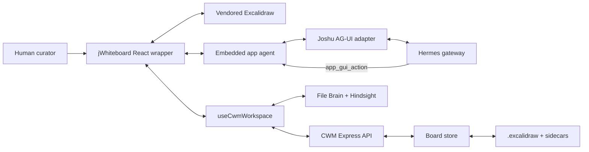
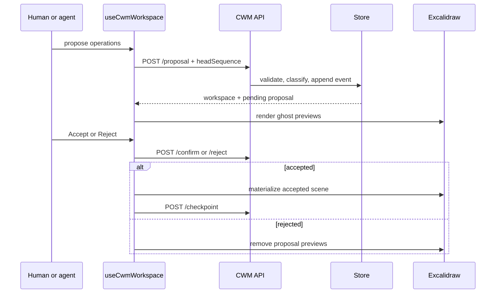

# jWhiteboard developer guide

This guide is the code-oriented entry point for developers working on
**jWhiteboard**, Joshu's Excalidraw-based Curatorial Whiteboard application.
It explains how the UI, semantic model, persistence layer, embedded Hermes
agent, voice/pointer path, and ArozOS packaging fit together.

For deeper treatment of individual subjects, use:

- [`jwhiteboard-user-guide.md`](jwhiteboard-user-guide.md) for the end-user
  session walkthrough and control cheat sheet;
- [`curatorial-whiteboard.md`](curatorial-whiteboard.md) for the CWM data model,
  authority policy, persistence contract, and bounded-context rules;
- [`excalidraw-sandbox.md`](excalidraw-sandbox.md) for Excalidraw fork history,
  Markdown behavior, ArozOS file-open conventions, and packaging;
- [`app-agent.md`](app-agent.md) for the generic embedded-agent and
  `app_gui_action` architecture;
- [`excalidraw-markdown-wysiwyg.md`](excalidraw-markdown-wysiwyg.md) for the
  vendored Markdown WYSIWYG changes.

## Product intent

jWhiteboard is not intended to be an autonomous diagram generator. It is a
shared visual workspace in which:

- Excalidraw owns visual elements, geometry, and the `.excalidraw` scene;
- the Curatorial Whiteboard Model (CWM) owns meaning, provenance, review state,
  regions, relations, and an audit trail;
- Hermes can retrieve, interpret, organize, and stage proposals;
- the human retains authority over acceptance, rejection, endorsement,
  commitment, and deletion.

The primary interaction should feel like **conversation plus curation**. The
semantic inspector, element typing, and soft-region controls are useful manual
fallback and debugging tools, but they do not all need to remain prominent in
the default product UI. The review tray and explicit consequential decisions
are the essential human-authority surface.

## Repository ownership

The workspace has multiple repositories:

- `joshu-oss/` is canonical for AGPL application, package, server, skill, and
  generic documentation code.
- `joshu/` is the private fleet superset. It receives shared code from OSS and
  owns fleet documentation, proprietary paths, and the ArozOS vendor submodule.
- `joshu-control-plane/` is unrelated to normal jWhiteboard implementation.
- `joshu-design/` supplies optional branded assets and tokens.

Make shared code changes in `joshu-oss` first. Fleet code can be mirrored for
local testing, but normal landed changes move through
`joshu/scripts/sync-from-oss.sh`. Do not commit changes inside
`joshu/vendor/arozos`; Joshu-owned ArozOS changes belong in the patch workflow.

Fleet documentation under `joshu/docs/` is the full source. The public
`joshu-oss/docs/` tree is a curated snapshot.

## System architecture



The runtime has five principal layers:

1. **Canvas:** the vendored Excalidraw fork renders and edits scene elements.
2. **Wrapper:** `apps/excalidraw` handles file loading, toolbar actions, CWM UI,
   pointer capture, voice, and the embedded agent.
3. **Pure semantic package:** `@joshu/whiteboard-cwm` defines and reduces CWM
   state without React, Express, or filesystem dependencies.
4. **Local server:** the CWM API validates requests, serializes mutations, and
   persists scenes, sidecars, events, and handoffs.
5. **Agent platform:** `@joshu/app-agent`, AG-UI, Hermes, the whiteboard skill,
   and platform data services provide chat, GUI actions, and bounded recall.

## Source map

### Application wrapper

| Path | Responsibility |
|------|----------------|
| `apps/excalidraw/src/main.tsx` | Application composition, ArozOS/file loading, toolbar, New Board, import/export, chat/voice mounting, and link handling. |
| `apps/excalidraw/src/styles.css` | Wrapper, toolbar, CWM panel, preview, and pointer presentation. |
| `apps/excalidraw/vite.config.ts` | Vite build and source aliases into the Excalidraw fork and Joshu packages. |
| `apps/excalidraw/src/markdown/` | Local Markdown file parsing and conversion into native fork text elements. |

### CWM frontend

| Path | Responsibility |
|------|----------------|
| `cwm/useCwmWorkspace.ts` | Main controller hook: load/refresh, proposals, review, checkpoint, consolidation, recall, selection, status, and bounded snapshots. |
| `cwm/apiClient.ts` | Typed browser client for `/joshu/api/excalidraw/cwm`. |
| `cwm/CwmPanels.tsx` | Workspace status, Move-forward accepted-decision list, checkpoint, and consolidation controls. |
| `cwm/PendingDecisionOverlay.tsx` | Source-anchored Accept/Dismiss chips for pending decisions. |
| `cwm/sceneMaterializer.ts` | Normalize scene bindings, render proposal ghosts, materialize accepted operations, and remove previews. |
| `cwm/sceneSnapshot.ts` | Produce the ranked, size-bounded scene context sent to the agent. |
| `cwm/retrieval.ts` | Normalize, deduplicate, diversify, and cap File Brain/Hindsight results. |
| `cwm/newBoard.ts` | Convert a user board name into a safe `Planning/*.excalidraw` path. |
| `cwm/useJoshuPointer.ts` | Capture bounded pointer traces and connect them to CWM deictic context. |
| `cwm/deicticResolver.ts` | Resolve selection, lasso, pass-through, and nearby-sweep references with confidence. |
| `cwm/JoshuPointerOverlay.tsx` | Render active/fading traces and semantic focus without adding scene elements. |

### Whiteboard agent

| Path | Responsibility |
|------|----------------|
| `agent/whiteboardAppManifest.ts` | Frontend copy of the app manifest and safe GUI action definitions. |
| `agent/guiActions.ts` | Register browser handlers for declared GUI actions. |
| `agent/bridge.ts` | Translate GUI action calls into CWM controller calls. |
| `agent/cwmCoercion.ts` | Coerce untrusted model arguments into bounded, provenance-bearing, AI-safe CWM operations. |
| `jWhiteboardVoice.ts` | Start and monitor the realtime voice session for the whiteboard surface. |
| `arozos/subservice/excalidraw/skills/whiteboard-gui/SKILL.md` | Hermes procedure and authority boundaries when jWhiteboard is open. |
| `arozos/subservice/excalidraw/joshu.app.json` | Packaged app identity, data declarations, skill, and GUI action contract. |

The frontend action manifest and packaged `joshu.app.json` must stay aligned.
`agent/manifestAlignment.test.ts` enforces this.

### Pure semantic package

| Path | Responsibility |
|------|----------------|
| `packages/whiteboard-cwm/src/types.ts` | Workspace, object, relation, region, proposal, event, provenance, focus, and operation types. |
| `operations.ts` | Pure semantic operation application and inverse derivation helpers. |
| `policy.ts` | Authority classification and disposition rules. |
| `reducer.ts` | Ordered event reduction, proposal resolution, compensation, and replay. |
| `validation.ts` | Runtime validation, referential integrity, and bounded limits. |
| `handoff.ts` | Classify accepted work and render a bounded Markdown session handoff. |

Keep this package deterministic and side-effect free. React state, HTTP,
filesystem access, model calls, and Excalidraw APIs do not belong here.

### Backend and platform

| Path | Responsibility |
|------|----------------|
| `src/excalidrawApi.ts` | Localhost/CORS gate and HTTP route parsing. |
| `src/excalidraw/paths.ts` | Traversal-safe board and handoff path derivation. |
| `src/excalidraw/scene.ts` | Validation of complete JSON-only Excalidraw envelopes. |
| `src/excalidraw/store.ts` | Exclusive creation, sidecar bootstrap, event append, atomic writes, locking, replay repair, and optimistic concurrency. |
| `src/excalidraw/service.ts` | Domain service for create, propose, confirm, reject, compensate, checkpoint, and consolidate. |
| `src/filesApi.ts` | Read-only file context and reads under `joshu's files`. |
| `src/agUiApi.ts` | AG-UI SSE adapter, local cross-port CORS, Hermes streaming, and GUI-action event emission. |
| `src/agUiAppContext.ts` | App-scoped system messages and bounded GUI context. |
| `src/appGuiActionApi.ts` | Queue/drain and fallback parsing for `app_gui_action`. |
| `src/hermesApi.ts` | Hermes gateway lifecycle, provider configuration, chat stream parsing, and credential synchronization. |
| `packages/app-agent/` | Reusable CopilotKit provider, chat panel, GUI readable/action hooks, HTTP agent, and session management. |
| `packages/voice-realtime/` | Realtime voice service and app-surface prompt context. |

## Boot and packaging flow

The integrated local command is:

```bash
npm run dev:arozos
```

`scripts/dev-arozos.sh`:

1. loads Hermes-home defaults and then reloads the project `.env` so local
   project credentials win;
2. starts or verifies Camofox, Hindsight, gbrain, connectors, voice, and Joshu;
3. builds the Excalidraw bundle;
4. copies it into the local ArozOS subservice tree;
5. launches ArozOS on `127.0.0.1:8787`.

Joshu listens on `127.0.0.1:8788` with base path `/joshu`. jWhiteboard is a
static ArozOS subservice, so frontend changes are not live until the bundle is
rebuilt and copied or the integrated stack is restarted.

The production/image path follows the same shape: Vite writes
`dist/excalidraw`, image assembly copies it into the ArozOS template, and the
subservice serves the static application from its assigned private port.

## Board lifecycle

### New Board

**New Board** prompts for a portable name and creates:

```text
Planning/<name>.excalidraw
Planning/<name>.excalidraw.cwm.json
Planning/<name>.excalidraw.cwm.events.jsonl
```

Creation is exclusive. Existing board or sidecar paths produce HTTP `409`; the
server never overwrites them. A newly created empty board is valid and opens
immediately.

### Existing board

A board can enter through:

- an ArozOS double-click hash and same-origin `/media` read;
- `?file=`, `#file=`, or a `joshu://` path through the files API;
- the default daily `Planning/time-block-YYYY-MM-DD.excalidraw` startup path;
- the agent's restricted `openBoard` action.

CWM becomes active only when the wrapper can derive a clean relative lowercase
`.excalidraw` path under the resolved `joshu's files` root. Imported browser
files and Markdown remain useful canvas inputs but are not CWM-eligible.

### Scene state versus semantic state

The app intentionally has separate durability mechanisms:

- **Excalidraw scene:** visual elements and geometry in `.excalidraw`;
- **CWM workspace:** materialized semantic state in `.cwm.json`;
- **CWM event log:** authoritative append-only order in `.cwm.events.jsonl`;
- **browser localStorage:** convenience recovery only, never the durable CWM
  record.

Visual edits are not continuously written to the board. **Checkpoint Board**,
proposal acceptance, and consolidation are explicit persistence boundaries.

## Semantic and authority model

Objects occupy one epistemic layer:

- `EVIDENCE`: source material and observations;
- `SENSEMAKING`: claims, questions, hypotheses, options, clusters, and comments;
- `COMMITMENT`: accepted decisions and tasks.

Statuses include `CAPTURED`, `PROPOSED`, `ENDORSED`, `DISPUTED`, `DECIDED`, and
`ARCHIVED`.

The policy classifies a transaction by its strongest operation:

- `EPHEMERAL`: local focus; no durable event;
- `MECHANICAL`: scene binding/checkpoint bookkeeping;
- `ORGANIZATIONAL`: regions, relations, and mode;
- `EPISTEMIC`: evidence and interpretation;
- `COMMITMENT`: decisions, commitments, and consequential removal.

AI-authored semantic content is forced to `PROPOSED`, requires provenance, and
can use only evidence or sensemaking layers. The agent cannot accept, reject,
commit, decide, delete, bind raw scene elements, or patch scene JSON.

## Proposal and review flow



Important ordering:

1. confirmation is durable before accepted scene materialization;
2. accepted visual state is then checkpointed;
3. rejection records an event but does not modify accepted semantics;
4. a stale `headSequence` causes refresh and retry rather than blind overwrite.

## Embedded chat and GUI actions

Each eligible board receives a board-scoped chat thread. The browser sends:

```text
POST /joshu/api/ag-ui/run
state: { appId: "excalidraw", mode: "embedded", gui: <bounded snapshot> }
```

The request path is:

1. `JoshuEmbeddedAppAgent` registers the GUI readable and actions.
2. `JoshuHttpAgent` injects the current bounded snapshot.
3. `src/agUiApi.ts` adds app system context and streams a Hermes turn.
4. Hermes calls server tool `app_gui_action`.
5. the Joshu app-GUI plugin queues the action by session.
6. AG-UI emits `CUSTOM app_action` and synthesized client tool events.
7. the registered browser handler calls the whiteboard bridge.

Available whiteboard actions are deliberately narrow:

- `recallToBoard`
- `stageOpening`
- `proposeTransaction`
- `showFocus`
- `focusRegion`
- `openBoard`

Ordinary chat does not guarantee a canvas change. A request changes the board
only when the model calls an allowed GUI action, and consequential results first
appear as proposals for review.

**Start Session** submits a stronger programmatic prompt instructing Hermes to
inspect the snapshot, retrieve only if needed, preserve divergence, and call
`stageOpening`.

## Bounded context and retrieval

The agent never receives the raw scene. `sceneSnapshot.ts` sends a bounded
representation containing viewport, selection, focus, opening brief, one
proposal summary, and ranked preview elements.

Key limits include:

- 20 selected element IDs;
- 12 focused region IDs;
- 40 scene-preview elements;
- 120 characters per preview text;
- 8 KiB serialized snapshot.

Recall queries File Brain and Hindsight concurrently. Results are normalized
defensively, deduplicated, alternated across available source lanes, and capped
at six cards. Retrieved cards are source-linked evidence proposals; retrieval
does not accept them or write broad memory.

## Pointer and voice

The Joshu Pointer is a wrapper overlay, not an Excalidraw element. It records at
most 500 downsampled points from the latest 30 seconds and keeps traces
ephemeral.

Resolution priority is:

1. explicit selection;
2. closed lasso;
3. pass-through trace;
4. nearby sweep;
5. no match.

Confidence below `0.7` requires visible focus and a compact confirmation
question before a consequential proposal. A final voice transcript binds to a
trace only when it completes no later than 1200 ms after that trace.

Voice acceptance is intentionally narrow: only exact final utterances
`accept proposal` and `reject proposal`, with exactly one pending proposal, use
the review path.

## Persistence and recovery

The store resolves and validates paths before filesystem access. Mutations are
serialized by absolute board path within the process.

For a mutation:

1. validate `headSequence`;
2. load and validate workspace and event log;
3. build and validate the next event/workspace;
4. append and `fsync` the event;
5. atomically rename any staged artifact;
6. atomically replace the materialized workspace sidecar.

If the process stops after event append but before sidecar replacement, the
next load replays the event tail and repairs the sidecar. Compensation appends a
new inverse event; it never erases history.

The lock is process-local. Multi-process writers and distributed collaboration
are outside the prototype contract.

## CWM API summary

Base path: `/joshu/api/excalidraw/cwm`

| Method | Route | Purpose |
|--------|-------|---------|
| `POST` | `/create` | Exclusively create a blank board and sidecars. |
| `GET` | `/board?path=…` | Load/bootstrap the workspace. |
| `GET` | `/events?path=…` | Read a bounded event tail. |
| `POST` | `/proposal` | Classify and apply or stage operations. |
| `POST` | `/confirm` | Human-confirm a pending proposal. |
| `POST` | `/reject` | Human-reject a pending proposal. |
| `POST` | `/compensate` | Append a compensating inverse event. |
| `POST` | `/checkpoint` | Atomically persist a complete scene envelope. |
| `POST` | `/consolidate` | Write a bounded Markdown handoff. |

The API is localhost-only and grants CORS only to localhost origins. Apart from
creation, mutations carry the expected `headSequence`.

`/compensate` is currently a backend recovery capability. The browser
`CwmApiClient` and CWM panels do not expose it, so adding user-facing undo
requires a deliberate client and review design rather than calling an existing
UI method.

Network boundaries differ across related APIs. CWM mutations and files reads
have localhost IP gates. AG-UI grants local-origin CORS, but `POST
/joshu/api/ag-ui/run` does not itself apply the same localhost IP check;
deployed access therefore also depends on the normal same-origin reverse proxy
and upstream authentication/network boundary. CORS is not authorization.

## Consolidation

**Consolidate Session**:

1. removes pending ghost elements;
2. checkpoints accepted visual state;
3. renders accepted CWM state into bounded Markdown;
4. writes under `Planning/cwm-sessions/`;
5. appends a mechanical consolidation event.

Pending proposals are excluded. The handoff is suitable for normal File Brain
indexing and links back to the board with a `joshu://` URI.

## Local development

### Integrated stack

```bash
npm run dev:arozos
```

Open `http://127.0.0.1:8787`, sign in, and launch jWhiteboard.

### Separate backend and frontend

```bash
npm run dev

VITE_JOSHU_FILES_API_BASE=http://127.0.0.1:8788/joshu/api/files \
VITE_JOSHU_CWM_API_BASE=http://127.0.0.1:8788/joshu/api/excalidraw/cwm \
npm run dev:excalidraw
```

The standalone Vite app runs on `127.0.0.1:3002`.

### Refresh a running ArozOS subservice

```bash
npm run build:excalidraw
rsync -a --delete dist/excalidraw/ .local/arozos-data/subservice/excalidraw/app/
```

Then hard-refresh or close and reopen the ArozOS app window.

## Build and tests

Run from the repository root:

```bash
npm run build
npm run build:excalidraw
npm test -w @joshu/whiteboard-cwm
npm run test:excalidraw-cwm-backend
npx tsx --test apps/excalidraw/src/cwm/*.test.ts apps/excalidraw/src/agent/*.test.ts
node --test \
  packages/app-agent/test/programmaticPromptRequest.test.mjs \
  packages/voice-realtime/test/voiceAppContext.test.mjs
```

Coverage is divided intentionally:

- package tests exercise policy, pure operations, replay, compensation,
  validation, and handoff bounds;
- frontend tests exercise coercion, manifest alignment, pointer resolution,
  snapshots, retrieval, scene materialization, and board-name validation;
- backend tests exercise traversal, exclusive creation, bootstrap, CORS,
  review, optimistic concurrency, checkpoints, crash repair, and handoffs;
- app-agent and voice tests exercise prompt idempotency and whiteboard surface
  grounding.

## Troubleshooting

### UI changes do not appear

The ArozOS subservice serves copied static files, not Vite source. Rebuild and
rsync the bundle or restart `dev:arozos`, then reopen the app.

### CWM is inactive

Confirm the board:

- has a lowercase `.excalidraw` suffix;
- is under `joshu's files`;
- was opened through a path the wrapper can prove;
- is a regular file, not a symlink.

Browser-imported files and Markdown are intentionally ineligible.

### New Board returns `409`

The board or one of its exact sidecars already exists. Choose another name or
open the existing board. Creation never overwrites.

### Proposal returns `409`

Another operation advanced the CWM head. Refresh and retry against the returned
actual head; do not suppress optimistic concurrency.

### Chat composer sends but nothing appears

Inspect the Joshu log and browser Network panel in order:

1. `OPTIONS /joshu/api/ag-ui/run` should return `204`.
2. `POST /joshu/api/ag-ui/run` should remain open long enough to stream.
3. SSE should include `TEXT_MESSAGE_CONTENT`.
4. A board mutation additionally requires an `app_gui_action` tool call and
   `CUSTOM app_action`.

If preflight occurs without POST, inspect local AG-UI CORS in `src/agUiApi.ts`.
If POST immediately finishes without content, probe Hermes/provider health; an
empty stream is not a successful model turn.

Local environment precedence matters. `scripts/dev-arozos.sh` loads
`~/.hermes/.env` as a fallback and then reloads `joshu/.env`, so the project
credential wins. `src/hermesApi.ts` synchronizes current LLM credentials into
Hermes home and restarts the gateway when that file changes.

An OpenRouter `401 User not found` from Hermes usually means the gateway started
with a stale provider credential even if a direct call with the project key
works. Stop the full stack, confirm the current script ordering, and restart;
restarting only the browser cannot repair gateway environment.

### Chat responds but the canvas does not change

This can be correct. Read-only questions produce text. Canvas/CWM changes occur
only through declared GUI actions and remain pending until human review. Use
**Start Session** for the explicit staged-opening flow.

If the model *claims* it added a sticky and nothing appears, check these in
order:

1. **Hermes tool result for `app_gui_action`.** Success means
   `proposeTransaction` / `stageOpening` / `recallToBoard` returned `ok: true`.
   The sticky should show as a **dashed Review-tray preview**, not a committed
   note. Accept in the tray to materialize it.
2. **`write_file` / `patch` / `skill_view('excalidraw')` instead of GUI.** Those
   mutate the `.excalidraw` file on disk. The open canvas keeps an in-memory
   scene and **does not auto-reload**. Reopen the board to see disk edits, and
   treat that path as a bug: the skill and embedded prompts forbid it when the
   window is open.
3. **`ok: false` / missing session key.** Enqueue runs in the
   `joshu-app-gui` **`post_tool_call` hook** (Hermes passes `session_id` to
   hooks, not tool handlers). After changing
   `.hermes/plugins/joshu-app-gui/`, restart the Hermes gateway. AG-UI also
   falls back to parsing the tool-result JSON when the queue is empty.
4. **`skill_view('whiteboard-gui')` not found.** App skills sync to
   `$HERMES_HOME/skills/apps/<appId>/` and `$HERMES_HOME/skills/joshu/`. Hermes
   caches the skill index per session — start a **new chat** after sync, or
   restart the gateway if the skill was just installed.
5. **Wrong `proposeTransaction` shape.** Expect
   `args.transaction.{rationale, operations[]}` with nested
   `UPSERT_OBJECT.object.{kind,layer,title,body,provenance}` — not
   `{type:"add_note", content}` or raw Excalidraw elements. Coercion recovers
   some hallucinations; check the browser handler / Network for proposal
   errors.

### Proposal ghost remains after an error

Refresh the workspace. Confirmation is durable before scene materialization;
the preview is not proof that accepted semantic state was lost.

## Safe extension patterns

### Add a semantic operation

1. Add the type in `packages/whiteboard-cwm/src/types.ts`.
2. Add runtime validation.
3. Define pure application and exact inverse behavior.
4. Update authority classification.
5. Update reducer/event validation.
6. Decide whether and how it materializes visually.
7. Add package, frontend, and backend tests as applicable.
8. Expose it to the agent only if it preserves the authority boundary.

### Add an agent GUI action

1. Add the action to `agent/whiteboardAppManifest.ts`.
2. Mirror the definition in packaged `joshu.app.json`.
3. Add a handler in `agent/guiActions.ts`.
4. Add a constrained bridge method.
5. Update `whiteboard-gui/SKILL.md`.
6. Update manifest alignment/coercion tests.

Do not expose generic scene mutation or a catch-all transaction that bypasses
coercion and authority policy.

### Add a panel control

Prefer a controller method in `useCwmWorkspace.ts` and a thin view in
`CwmPanels.tsx`. Keep HTTP details in `apiClient.ts`, pure model logic in the
CWM package, and Excalidraw conversion in `sceneMaterializer.ts`.

### Change persistence

Preserve:

- traversal and symlink checks;
- exclusive creation;
- event-first durability;
- atomic same-directory replacement;
- contiguous event sequences;
- optimistic `headSequence`;
- crash-tail replay;
- bounded runtime validation.

## Session prototype status (paused 2026-07-28)

Work on the **in-session apply path** (notes/questions/decisions land immediately
with a `↳` action note; no Accept chips) reached a usable but unfinished state.
Stop here and resume from this section rather than re-deriving behavior from chat
history.

### What works now

| Area | Behavior |
|------|----------|
| Session writes | `proposeTransaction` / `stageOpening` / `recallToBoard` → `POST /cwm/proposal` → `materializeConfirmedOperations` → autosave. No Review-tray Accept for session kinds. |
| AG-UI gate | If `cwmReady` and the turn looks like review/orient/capture (or empty board), AG-UI retries once when Hermes never emitted a board-mutating `app_gui_action`. |
| Arg coercion | `apps/excalidraw/src/agent/cwmCoercion.ts` recovers common Hermes hallucinations (`kind` vs `type`, string provenance, etc.). |
| Sticky layout | Bound text, soft-wrap, content-based height, 2-column pack for new cards without geometry (`sceneMaterializer.ts`). |
| Title/body dedupe | `composeCardText` omits duplicate title when body equals or already starts with title. |
| Action notes | Plain `↳ …` text under the **CWM object id** that was in the operation (`customData.cwm.objectId`). Placement is geometric under that card, not chat deixis. |
| Re-UPSERT spam | Identical re-UPSERT of an existing CWM card does not add another `↳` note. |
| Anchored selection | Clicking the chat composer clears live Excalidraw selection; snapshot keeps the last canvas selection (`selectionSource: "anchored"`) so “this/these” can still resolve. |

### Known failure modes (observed in manual sessions)

1. **Wrong sticky updated.** User selects or points at card A; Hermes narrates or `UPSERT`s card B from earlier chat. Skill/prompt say `selectedItems` wins; there is **no mechanical gate** that rejects a transaction whose object ids are outside the current selection / deictic candidates.
2. **Pointer “confirm target” ignored.** Pass-through at 0.62 with multiple candidates sets `groundingRequired`. UI shows `confirm target`. Skill says ask before `proposeTransaction`; the model often proposes anyway.
3. **Confused agent narration.** Responses like “already queued / refresh the board” are hallucinations. Session applies are immediate via the GUI bridge; there is no apply queue the user must refresh for.
4. **Duplicate cards from double `stageOpening`.** Two opening batches can create two semantic objects (and two stickies) for the same content. Title/body dedupe only fixes text *inside* one card.
5. **Board-mutation gate is emission-based.** The AG-UI retry counts whether a mutating action was *emitted* on the SSE stream, not whether the canvas successfully applied it.
6. **Existing cards are not rematerialized.** Layout/dedupe fixes apply on the next materialize of new/updated ops. Stale boards need **New Board** or a fresh seed after pulling a new Excalidraw bundle.
7. **Docs drift.** Older sections of this guide and `curatorial-whiteboard.md` still describe Accept chips / Review-tray ghosts. Session mode applies immediately; treat those paragraphs as legacy until rewritten.

### `proposeTransaction` (current contract)

Hermes → `app_gui_action` → bridge `proposeTransaction` → `coerceAgentTransaction` →
`cwm.proposeOperations` → CWM event + immediate scene materialize.

- Payload: `args.transaction.{ rationale, operations[] }`.
- One `UPSERT_OBJECT` per sticky.
- Status updates (“mark done”) should keep sticky wording and rely on the `↳`
  note from `rationale`; the materializer does not rewrite original sticky text
  for existing CWM-generated cards.
- The `↳` note is attached to the **object id in the op**, period.

Sibling mutating actions: `stageOpening` (opening brief + sources),
`recallToBoard` (bounded File Brain / Hindsight notes). Non-mutating:
`showFocus`, `focusRegion`, `openBoard`.

### Design fork not built: skip Hermes for pointer intents

Pointer resolution is already deterministic (`deicticResolver.ts`): selection →
closed lasso → pass-through → sweep, with confidence and `groundingRequired`.

For grounded turns like “mark this done,” the useful action set is tiny
(done / archive / dismiss / confirm-which / focus). Those can call
`proposeOperations` locally on the confirmed object id without Hermes — same
pattern as voice’s exact `accept proposal` / `reject proposal` bypass.

**Proposed split (not implemented):**

- **Local:** pointer/selection + closed phrase set → apply on confirmed target(s);
  if `groundingRequired`, show focus and wait for confirm; never write a
  different object id than the grounded set.
- **Hermes:** open-ended curation, recall, stage opening, ambiguous language,
  side effects outside the board (Kanban, memory).

Building that gate would address the wrong-card and ignored-confirm failures
above. Do not claim it exists until the local path ships.

### Local reload checklist (dev)

1. Edit in `joshu-oss` first; copy into fleet `joshu` when testing under
   `npm run dev:arozos`.
2. `npm run build:excalidraw` in fleet.
3. Rsync `dist/excalidraw/` into
   `.local/arozos-data/subservice/excalidraw/app/` (and template if used).
4. Hard-refresh the browser; confirm a new `index-*.js` hash in `index.html`.
5. Prefer **New Board** after materializer changes; start a **new chat** after
   skill sync.

## Current limitations

- jWhiteboard is packaged in local and image builds, but CWM remains a
  single-process prototype with no realtime multi-user collaboration.
- No distributed filesystem lock.
- No historical `.excalidraw` artifact version store.
- Compensation reverses semantic events, not prior scene bytes or handoff files.
- Compensation has a backend API but no browser client or user-facing undo UI.
- Markdown opens as canvas content but is not written back.
- Session mode applies notes/questions/decisions immediately; there is no
  Accept/Dismiss chip path in the current UI (older “human review” wording in
  this doc is stale for session turns).
- Pointer/selection grounding for agent writes is still soft (prompt/skill only);
  see **Session prototype status** above.
- Retrieval is bounded and read-oriented; consolidation writes a local handoff
  rather than broad memory.
- CWM wrapper/server work does not require new edits inside the Excalidraw
  vendor submodule.

## Developer checklist

Before handing off a jWhiteboard change:

- [ ] Shared implementation was made in `joshu-oss` first.
- [ ] Frontend and packaged manifests remain aligned.
- [ ] AI paths preserve provenance and human review.
- [ ] Snapshot, retrieval, text, and operation bounds remain enforced.
- [ ] Traversal, symlink, and optimistic-concurrency checks remain intact.
- [ ] Root build and jWhiteboard build pass.
- [ ] Relevant package, frontend, backend, app-agent, and voice tests pass.
- [ ] The running ArozOS static bundle was refreshed before manual testing.
- [ ] Chat was tested for both text response and an action-driven proposal.
- [ ] Fleet docs were updated first and the public docs snapshot was refreshed.
